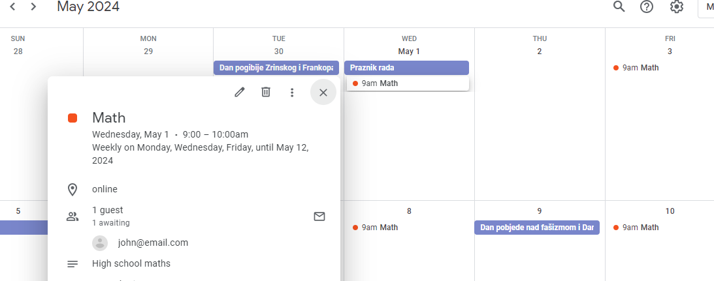
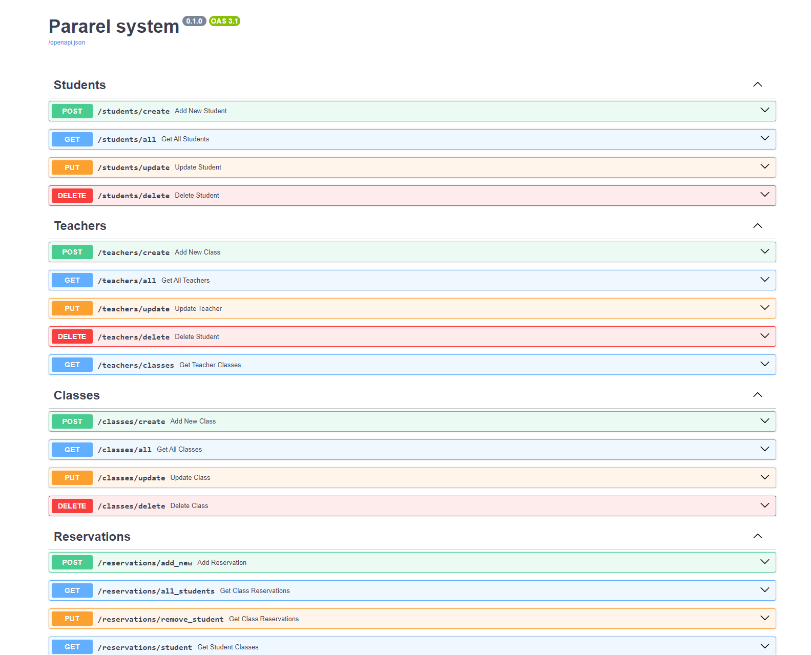

# TUTORING SCHOOL SYSTEM
___

This is  a project i built for learning purposes, it uses FastApi to create a  tutoring school backend
system integrated with [Google Calendar API](https://developers.google.com/calendar/api/guides/overview) 




___

## Features:
1. Keep track of students and teachers
    - Add, update and delete their data


2. Add new classes
    - each class is registered on Google calendar
    - set size of class,,name,description, start and end times
    - add atendees
    - set optional recurring frequency
    - delete and update events


3. Student reservations
    - link student to new class, update Google calendar automaticaly
    - remove student from class
    - class size limit
    - all atendees recive notifications via email/popup


4. Keep tracks of invoices
    - organize invoices in one place

___
## User guide:

### Get ready:
- First go to your [Google Calendar page ](https://calendar.google.com/)
- Create new calendar, and copy calendar ID
- in .env.example you have fields for configuring CALENDAR_ID and TIME_ZONE
- delete .example part so you are left with .env file containing your data
- You need to create a [Google Cloud project](https://developers.google.com/calendar/api/quickstart/python) 
   ,enable Calendar API and get OAuth credentials
> Copy your OAuth json file contents to creds.json, remove .example extension
>>Code will automatically create token.json in same folder to store session token
___
### Requirements:
- Install requirements

```bsh
pip install -r ./requirements.txt
```
___

### Run:
- Run simply with 

```bash
uvicorn api.server:app --reload
```
___

### Docs:

Visit **localhost:8000/docs** for interactive Swagger docs



___
> In development! :)