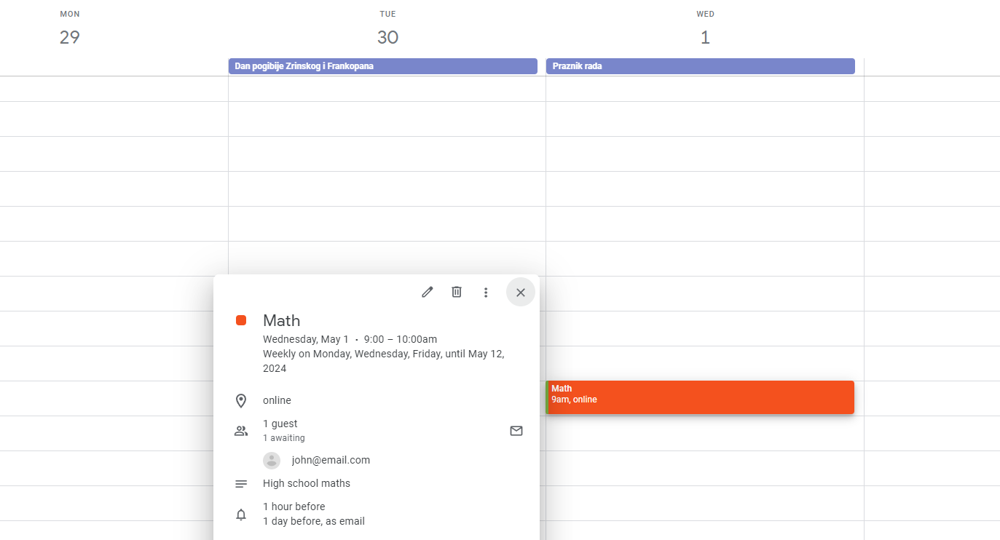
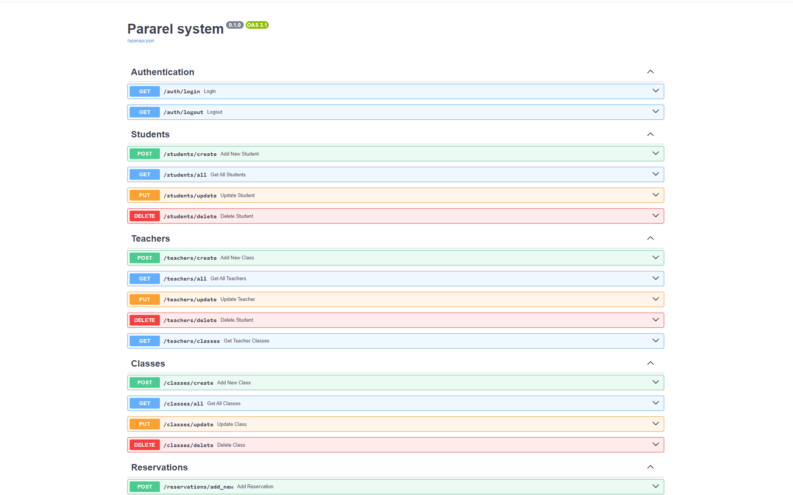
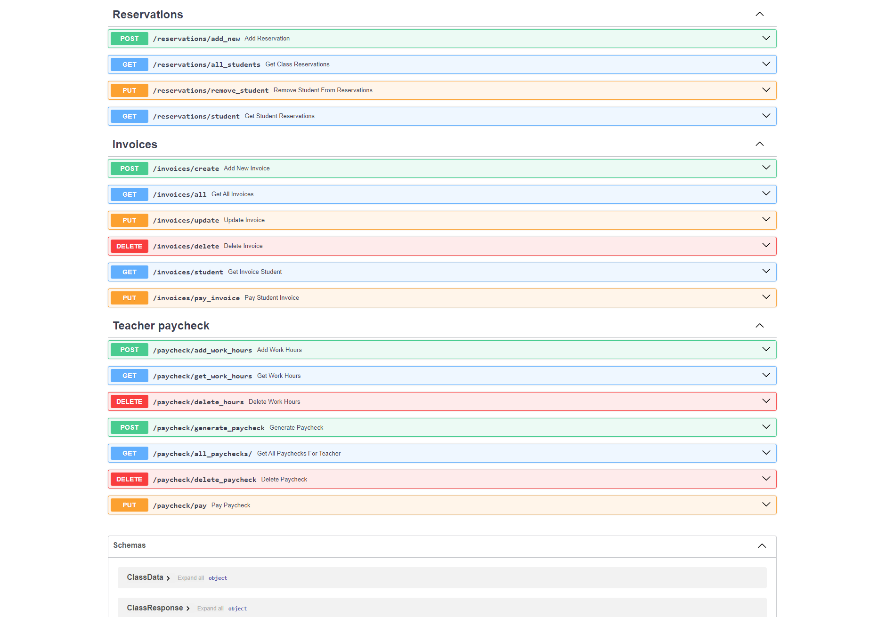

# :books: TUTORING SCHOOL SYSTEM
___

This is  a project i built for learning purposes, it uses **FastApi** to create a  tutoring school backend
system integrated with [Google Calendar API](https://developers.google.com/calendar/api/guides/overview).

Main idea is to create a ERP system to make it easier to manage tutoring school needs.
Api is built on FastApi with Pydantic models for json serialization, async Sqlalchemy orm for database interaction,
and Docker for easy deployment. 



___

## :bulb: Features:

1. **Log in**
   - Login/logout using google Oauth

   

2. **Keep track of students and teachers**
    - Add, update and delete student and teacher data
    - filter students and teachers based on email, phone, or last name, pagination via page and limit


3. **Add new classes**
    - filter classes based on name, date or description, pagination via page and limit 
    - each class is registered on Google calendar
    - set size of class,name,description, start and end times
    - add atendees
    - set optional recurring frequency
    - delete and update events


4. **Student reservations**
    - link student to new class, update Google calendar automaticaly
    - remove student from class
    - class size limit
    - all atendees recive notifications via email/popup


5. **Keep tracks of student invoices**
    - filter invoices by date of creation or payment status, pagination via page and limit
    - get all invoices for student
    - organize invoices in one place
    - auto create invoice when class is booked


6. **Keep track of teacher finances**
   - keep track of teacher work hours
   - generate paychecks, with payment amount, work hours
   - filter work hours by teacher id, start and end date of date range,pagination via page and limit
   - filter paychecks by teacher id ,payment status,start and end date of date range,pagination via page and limit
   - pay paychecks

___
## :book: User guide:

### Get ready:
- First go to your [Google Calendar page ](https://calendar.google.com/)
- Create new calendar, and copy calendar ID
- in .env.example you have fields for configuring CALENDAR_ID and TIME_ZONE
- delete .example part so you are left with .env file containing your data
- You need to create a [Google Cloud project](https://developers.google.com/calendar/api/quickstart/python) 
   ,enable Calendar API and get OAuth credentials
> Copy your OAuth json file contents to creds.json, remove .example extension
>>Code will automatically create token.json in same folder to store session token

___
### :rocket: Run with Docker:
- Api is dockerized with docker-compose, one command runs the Api server, Postgres server and PgAdmin
- Make sure to have Docker installed, if on Windows use [Docker Desktop](https://www.docker.com/products/docker-desktop/)
- Navigate to your project directory and run command

```bash
docker compose up
```

- Verify the compose containers running with: 
```bash
docker ps
```

- **Thats it!**
- **School System Api** is available on **localhost:8000**, **PgAdmin** is available on **localhost:8080** 
- **Postgres Database** is externally available on **localhost:5433**, while for containers use **db:5432**

>For running without docker, you can set .env USE_LOCAL_DB=True, which will instead use local sqlite database
>> Use uvicorn api.server:app --reload for running without Docker
___


### :page_with_curl: Docs:

- Visit **localhost:8000/docs** for interactive Swagger UI docs, or **localhost:8000/redoc** for ReDoc docs.


 


___
> In development! :)